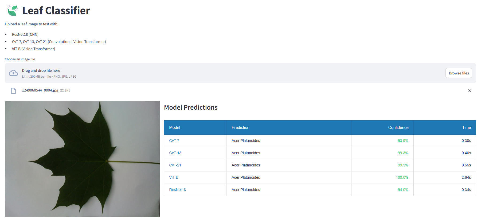

# Introduction

This project evaluates the performance of Convolutional Vision Transformers (CvT) against traditional CNN (ResNet-18) and Vision Transformer (ViT-B) architectures. Additionally, we experiment a lightweight CvT variant for efficient leaf classification.




## Dataset

The experiments are conducted on the [Leafsnap Dataset](https://www.kaggle.com/datasets/xhlulu/leafsnap-dataset), which contains:
- 185 species of trees from the Northeastern United States
- Lab images (23,147): high-quality pressed leaf photos from the Smithsonian collection, with both backlit and front-lit versions.
- Field images (7,719): typical mobile phone photos taken outdoors, with blur, noise, shadows, and varied lighting conditions..

## Model Performance

| Model    | Parameters | Accuracy |
|----------|------------|----------|
| ResNet-18| 11.7M     | 89.84%    | 
| ViT-B    | 86.1M     | 91.12%    | 
| CvT-13   | 19.3M     | 94.65%    | 
| CvT-21   | 27.6M     | 93.65%    | 
| CvT-7    | 6.8M      | 91.22%    | 

## Quick Start


### Training
To train a model from scratch:
```bash
python tools/train.py --config configs/cvt-13-224x224.yaml \
                     --data_dir path/to/dataset \
                     --output_dir path/to/checkpoint/folder
```

### Testing
Evaluate a trained model:
```bash
python tools/test.py --config configs/cvt-13-224x224.yaml \
                    --weights path/to/weights.pth \
                    --data_dir path/to/dataset
```

### Demo Application
Run the interactive Streamlit demo:
```bash
cd demo
streamlit run app.py
```

